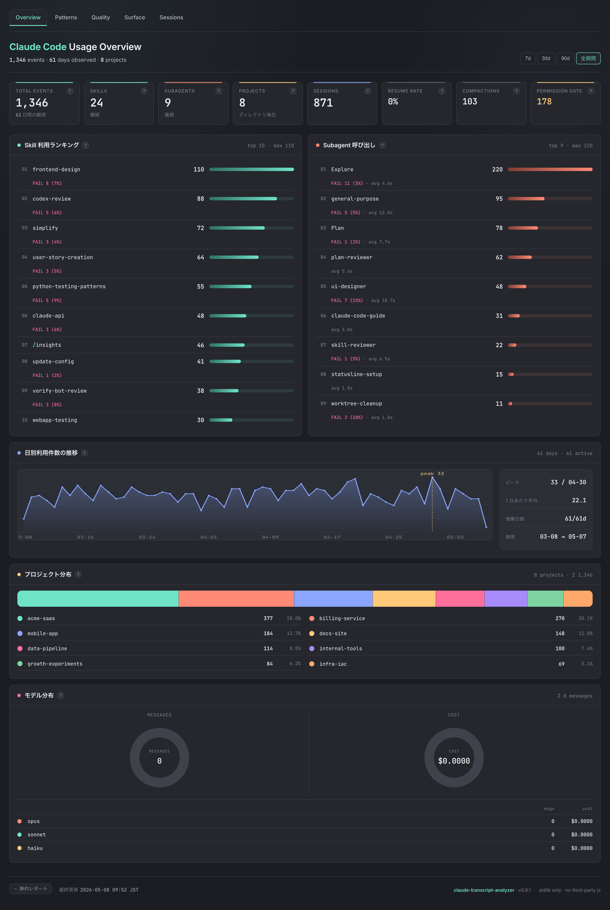
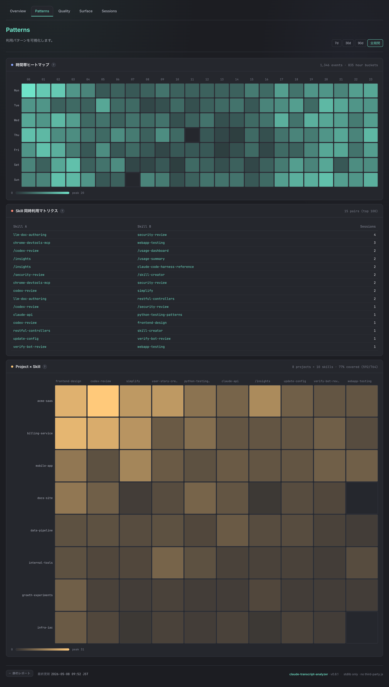
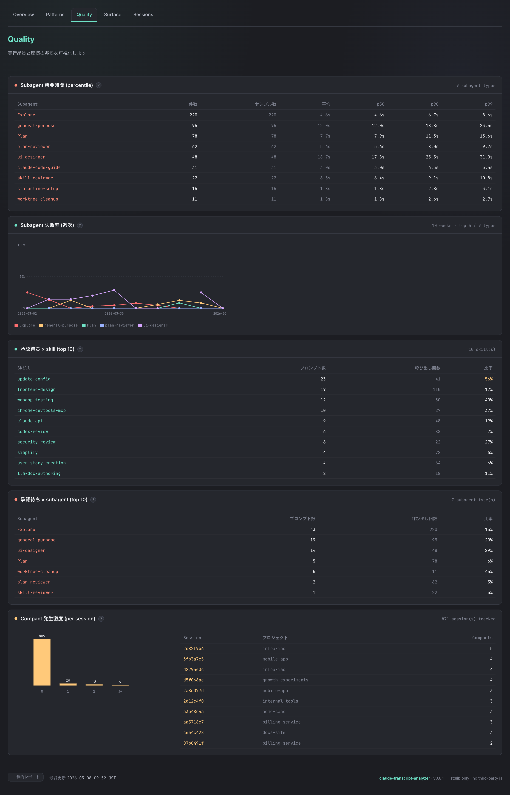
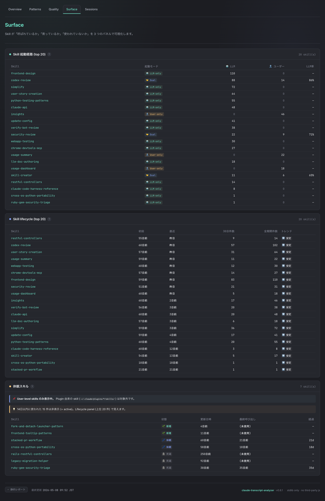
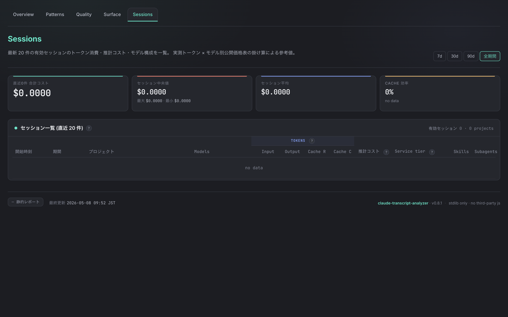

# claude-transcript-analyzer

Claude Code の Skills と Subagents の使用状況を自動収集・集計するツール。

## 仕組み

Claude Code の Hooks 機能を使い、以下のイベントを `~/.claude/transcript-analyzer/usage.jsonl` へリアルタイムに記録する：

| イベント | 収集タイミング |
|---------|--------------|
| `skill_tool` / `user_slash_command` | スキル / スラッシュコマンドの呼び出し（自律発火 / 手動入力） |
| `subagent_start` / `subagent_stop` | Task ツール経由の Subagent 呼び出し（所要時間付き） |
| `session_start` / `session_end` | Claude Code セッション境界 |
| `compact_start` | コンテキスト自動圧縮（PreCompact）の発火 |
| `notification` (permission) | 許可ダイアログの発生 |

直近 180 日分は hot tier (`usage.jsonl`)、それ以前は月次で `archive/YYYY-MM.jsonl.gz` に gzip 圧縮アーカイブされる（`scripts/archive_usage.py` がべき等に自動実行）。

## インストール

**前提条件:** macOS / Linux / Windows、Python 3.8 以上 (`python3` または `python` のいずれかが PATH 上にあること)、Claude Code インストール済み

Claude Code のチャット内で以下を実行する：

```
/plugin marketplace add https://github.com/tetran/claude-transcript-analyzer
/plugin install claude-transcript-analyzer@kkoichi-cc-plugin
```

その後、Claude Code を再起動する。

### Python 解決方式

プラグインの hook と slash command は **bash の POSIX `command -v` fallback** で Python を解決する (Issue #33)：

```bash
"$(command -v python3 || command -v python)" ${CLAUDE_PLUGIN_ROOT}/hooks/foo.py
```

`python3` を優先し、無ければ `python` にフォールバックする。Claude Code hook の `command` フィールドは全 OS でデフォルト bash で実行されるため、この POSIX 構文が macOS / Linux / Windows のどれでも一律に動く。`$(...)` を double-quote で囲むのは、Windows で Python が `C:\Program Files\Python311\python.exe` のようにスペース入りパスにインストールされていても bash の word splitting で分割されないようにするため。

| OS | 動作 |
|----|------|
| Windows | 公式インストーラ / Microsoft Store / Python Launcher のいずれで入れても `python.exe` または `python3.exe` のどちらかが PATH 上に来れば動く（alias を作る必要なし）。Claude Code hook は内部的に bash を spawn するため Git for Windows / WSL のいずれかが必要 |
| macOS (Homebrew) | `brew install python@3.x` で `python3` が入る。`python` symlink の有無は問わない |
| Linux | `python3` 単独提供が主流の Ubuntu 22+ / Debian 系をそのまま使える。`python-is-python3` 等の追加措置は不要 |

二重保険として、`hooks/*.py` の各スクリプトには shebang `#!/usr/bin/env python3` と実行ビット (`chmod +x`) が付与されている。`$()` が空展開した場合 (PATH 上に `python3` も `python` も無い極端なケース) でも、`env: 'python3': No such file or directory` という Python 不在の本当のエラーメッセージが出る。

> **経緯**: Issue #24 (PR #31) で `python` 統一としていたが、macOS Homebrew / Ubuntu 22+ の標準環境 (`python3` のみ) で hook が起動失敗するため、Issue #33 で `command -v` fallback に切り替えた。

### アンインストール

```
/plugin uninstall claude-transcript-analyzer
```

macOS / Linux / Windows 共通で同じ手順。

## 使い方

インストール後は Claude Code のチャット内からスラッシュコマンドで使う。
コマンド名には `/claude-transcript-analyzer:` のプレフィックスが付く。

### `/claude-transcript-analyzer:usage-summary` — ターミナル集計レポート

```
/claude-transcript-analyzer:usage-summary
```

`~/.claude/transcript-analyzer/usage.jsonl`（hot tier・直近 180 日）に記録されたイベントを集計し、Skills・Subagents の使用回数 + 失敗率 + 所要時間平均、Sessions 統計をターミナルに表示する。

出力例：

```
Total events: 1346

=== Sessions ===
  Total sessions:       871
  Resume rate:          0 (0%)
  Compact events:       103
  Permission prompts:   178

=== Skills (skill_tool + user_slash_command) ===
   110  fail=  6 (5%)  frontend-design
    88  fail=  4 (5%)  codex-review
    72  fail=  4 (6%)  simplify
    46  fail=  0 (-)   /insights
   ...

=== Subagents ===
   220  fail=  9 (4%)  avg=  4.6s  Explore
    95  fail=  8 (8%)  avg= 12.0s  general-purpose
    78  fail=  2 (3%)  avg=  7.7s  Plan
   ...
```

archive (`~/.claude/transcript-analyzer/archive/*.jsonl.gz`) も含めて全期間集計したい場合は `--include-archive` を渡す：

```
/claude-transcript-analyzer:usage-summary --include-archive
```

セッション別コスト上位 10 件を表示したい場合は `--include-cost` を渡す：

```
/claude-transcript-analyzer:usage-summary --include-cost
```

### `/claude-transcript-analyzer:usage-dashboard` — ブラウザダッシュボード

ダッシュボードは Claude Code のセッション開始 / プロンプト送信 / ツール実行 hook を契機に **べき等に自動起動** される（`hooks/launch_dashboard.py`）。
通常はスラッシュコマンドを叩く必要はなく、明示的に手動起動したいときの併存パスとして残してある：

```
/claude-transcript-analyzer:usage-dashboard
```

ポートは OS が割り当てる空きポート（default `DASHBOARD_PORT=0`）。URL は起動時 stderr に
`Dashboard available: http://localhost:<port>` の 1 行が出力されるほか、
`~/.claude/transcript-analyzer/server.json` の `url` フィールドからも取得できる：

```bash
cat ~/.claude/transcript-analyzer/server.json
# → {"pid": ..., "port": ..., "url": "http://localhost:...", "started_at": "..."}
```

ポートを固定したい場合は `DASHBOARD_PORT=9090` のように環境変数で指定する。
最後の HTTP リクエストから 10 分経過すると idle 自動停止する（`DASHBOARD_IDLE_SECONDS` で変更可、`0` で無効化）。停止後は次の Claude Code 操作で hook 経由で自動復活する。

ダッシュボードは 5 タブ構成：

#### Overview — 全体俯瞰

8 個の KPI カード (events / skills / subagents / projects / sessions / resume rate / compact / permission) +
スキル / Subagent 利用ランキング + 日別利用件数の推移 + プロジェクト分布 + モデル分布（opus / sonnet / haiku のメッセージ数・コスト内訳）。
右上の期間トグル (7d / 30d / 90d / 全期間) で集計レンジを切り替えられる。



#### Patterns — 利用パターン

時間帯ヒートマップ（曜日 × 時間帯） + スキル共起マトリクス（同セッション内の skill ペア）+
プロジェクト × スキル ヒートマップ。"いつ" / "誰と一緒に" / "どこで" 使われているかを可視化する。



#### Quality — 実行品質と摩擦シグナル

Subagent の所要時間 percentile (p50 / p90 / p99) + 失敗率の週次トレンド +
permission prompt の skill / subagent 別ランキング + Compact 発生密度ヒストグラム。
`settings.json` の allowlist 整理 / タスク粒度の見直しのヒントとして使える。



#### Surface — スキルの育ち方

LLM 自律 (`Skill` ツール) vs ユーザー手動 (`/foo`) の起動経路比較 +
skill lifecycle (初回 / 直近 / 30 日件数 / トレンド 📈➡️📉🌱) +
休眠中 skill 検知（🌱 新着 / 💤 休眠 / 🪦 死蔵）。
description が弱くて LLM が「思いつけない」skill や、書いたまま使われていない skill を浮かび上がらせる。



#### Sessions — セッション別コスト

選択期間内の有効セッション（assistant_usage を 1 件以上持つもの）から最新 20 件のトークン消費・推計コスト・モデル構成を一覧。
実測トークン × モデル別公開価格表の掛け算による参考値で、opus / sonnet / haiku の混在比率も可視化する。
右上の期間トグル (7d / 30d / 90d / 全期間) で Overview / Patterns と同じレンジに揃えて切り替えられる。
`/usage-summary --include-cost` との組み合わせで全期間ランキングと最新セッション詳細を横断確認できる。



### `/claude-transcript-analyzer:usage-export-html` — スタンドアロン HTML レポート

```
/claude-transcript-analyzer:usage-export-html
```

サーバー不要のスタンドアロン HTML ファイルを `~/.claude/transcript-analyzer/report.html` に生成する。
ブラウザで直接開けるほか、オフラインで共有・アーカイブするのにも使える。
出力先を変更したい場合は `--output /path/to/report.html` を渡す。

archive を含めて全期間で生成したい場合は `--include-archive` を渡す（default は hot tier のみ）：

```
/claude-transcript-analyzer:usage-export-html --include-archive
```

## データの保存場所

イベントログ等は `~/.claude/transcript-analyzer/` に保存される：

```
~/.claude/transcript-analyzer/
├── usage.jsonl           # hot tier イベントログ（直近 180 日・自動生成）
├── archive/              # cold tier 月次アーカイブ
│   └── YYYY-MM.jsonl.gz  # 180 日超のイベントを gzip 圧縮で保存
├── .archive_state.json   # archive job のべき等性 marker
├── health_alerts.jsonl   # transcript ↔ usage 照合の異常検知ログ（自動生成）
├── server.json           # ダッシュボード稼働中のメタデータ (pid / port / url)
└── report.html           # /usage-export-html の default 出力先
```

Windows では `%USERPROFILE%\.claude\transcript-analyzer\` (Claude Code 本体の `HOME` 解決と同じ規約)。

---

## その他のインストール方法

### プラグインとして手動インストール

```bash
git clone https://github.com/tetran/claude-transcript-analyzer ~/.claude/plugins/claude-transcript-analyzer
# → Claude Code を再起動する
```

Claude Code が `~/.claude/plugins/` 以下のプラグインを自動認識して hooks を登録する。

### 旧バージョンからのデータ移行

以前のバージョン（`data/usage.jsonl` に保存していた場合）はデータを移行できる：

```bash
mkdir -p ~/.claude/transcript-analyzer
mv data/usage.jsonl ~/.claude/transcript-analyzer/usage.jsonl
```

または環境変数で旧パスを指定したまま使い続けることもできる：

```bash
USAGE_JSONL=./data/usage.jsonl python3 dashboard/server.py
```

